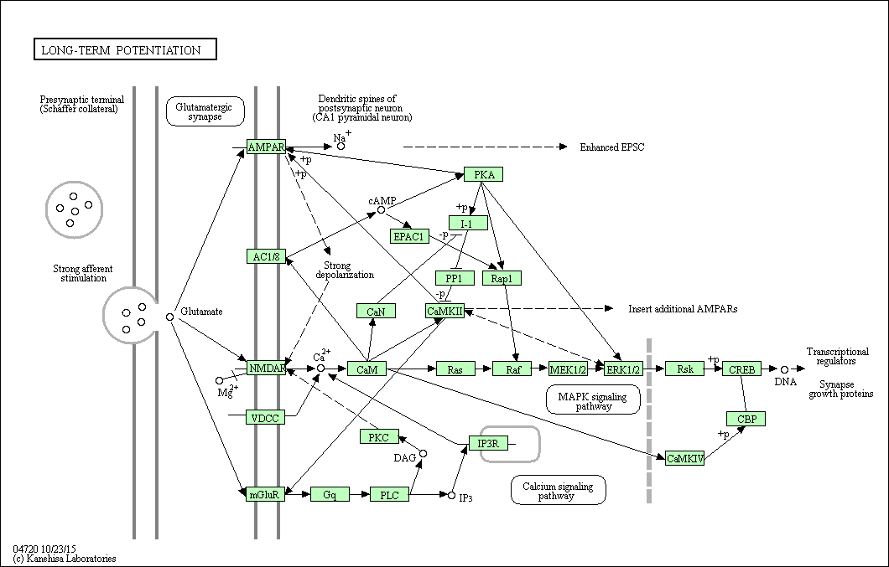

# Abstract
Retrospective cohort study of adamantane derivatives as neuroprotectants post-CVA

# Central NMDA Receptor Physiology
mGluR5-Ca2+ apoptosis					
- [KEGG Network: N00984](https://www.genome.jp/dbget-bin/www_bget?ne:N00984)				
- [KEGG Pathway: hsa04724](https://www.genome.jp/kegg-bin/show_pathway?hsa04724+N00984)				

Hippocampal long-tem potentiation				
- [KEGG Pathway: hsa04720](https://www.genome.jp/dbget-bin/www_bget?hsa04720)				

	

# Memantine Pharmacdynamics

## Central activity

### Glutamateric:
- Low-affinity voltage-dependent non-competitive antagonist at glutamatergic NMDA receptors
- NMDAR antagonist with higher affinity than Mg++, ultimatly inhibits prolonged Ca++ influx
### Serotonergic:
- Non-competitive antagonist at 5-HT3 receptor, potency similar to that for the NMDA receptor
### Cholinergic:
- Non-competitive antagonist at nAChRs with potencies possibly similar to NMDA and 5-HT3 receptors
### Dopaminergic:
- Agonist at D2 receptor with equal or slightly higher affinity than NMDA receptors
### Sigmaergic:
- Agonist at Sigma-1 receptor with low Ki ~= 2.6 μM (2600 nM)
- Therapeutic concentrations of memantine are most likely too low to have any sigmaergic effect, as a typical therapeutic dose is 20mg.
- Excessive doses of memantine (e.g. recreational use) may indeed activate Sigma-1
	- https://erowid.org/experiences/subs/exp_Pharms_Memantine.shtml

## Unknown NMDAR/GluR drug interactions
- Statins
- ACEi/ARB
- Ca++ channel blockers 
- Alpha-2 antagonists (precedex, clonidine)
- Octeotide
- Epoprostenol